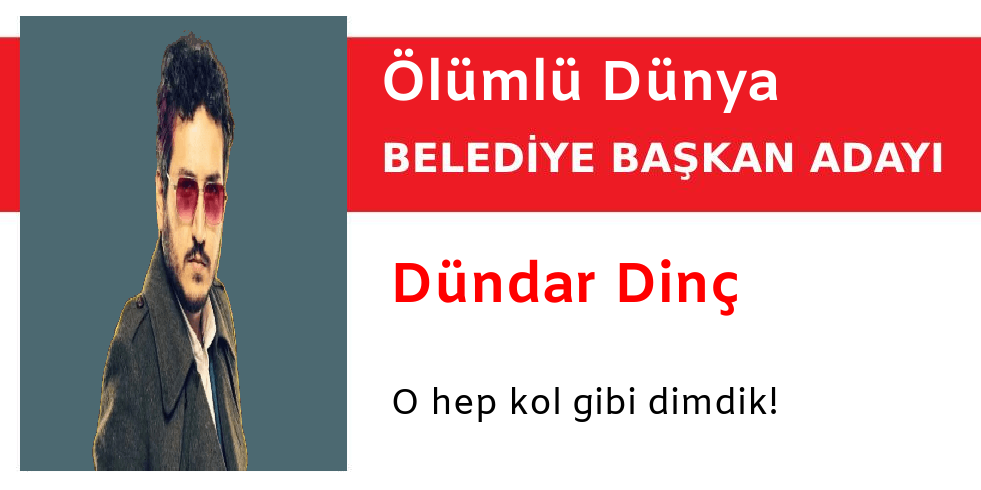

# Seçim Afişi Oluşturucu

Bu uygulama, kullanıcıların seçim afişleri oluşturmasını sağlayan basit bir web uygulamasıdır. Eğlence amaçlı oluşturulmuştur. Muhtarlık ve belediye seçimleri için hazırda olan şablonlar üzerine sizin fotoğrafınızı, adınızı, sloganınızı basarak bir afiş oluşturur.

## Deneyin

</img>

Uygulamayı https://osman-koc.github.io/secim-afisi-olusturucu linkinden deneyebilirsiniz.

## Ekran Görüntüleri

</img> &nbsp; </img>&nbsp; </img>&nbsp; </img>&nbsp; </img>

## Nasıl Kullanılır

1. Ana sayfada gerekli bilgileri girin:
   - Fotoğraf yükleyin
   - Adınızı ve soyadınızı girin
   - Bir slogan seçin
   - Afiş tipini ve belediye/mahalle ismini seçin
2. "Oluştur" butonuna tıklayın.
3. Oluşturulan afişi görüntüleyin, indirin veya paylaşın.

## Gereksinimler

- Python 3.7 veya üstü
- Flask ve Pillow kütüphaneleri

## Kurulum

1. Depoyu klonlayın:
   ```bash
   git clone https://github.com/osman-koc/secim-afisi-olusturucu.git
   ```
2. Proje dizinine gidin:
   ```bash
   cd secim-afisi-olusturucu
   ```
3. Sanal ortam oluşturun (isteğe bağlı):
   ```bash
   python -m venv venv
   ```
4. Sanal ortamı etkinleştirin (isteğe bağlı - 3.adımı yapanlar için):
    - Windows için
   ```bash
   venv\Scripts\activate
   ```
   - macOS/Linux için
   ```bash
   source venv/bin/activate
   ```
5. Gerekli paketleri yükleyin:
   ```bash
   pip install -r requirements.txt
   ```
6. Uygulamayı çalıştırın:
   ```bash
   python app.py
   ```
7. Tarayıcınızda http://127.0.0.1:5000/ adresine gidin.


